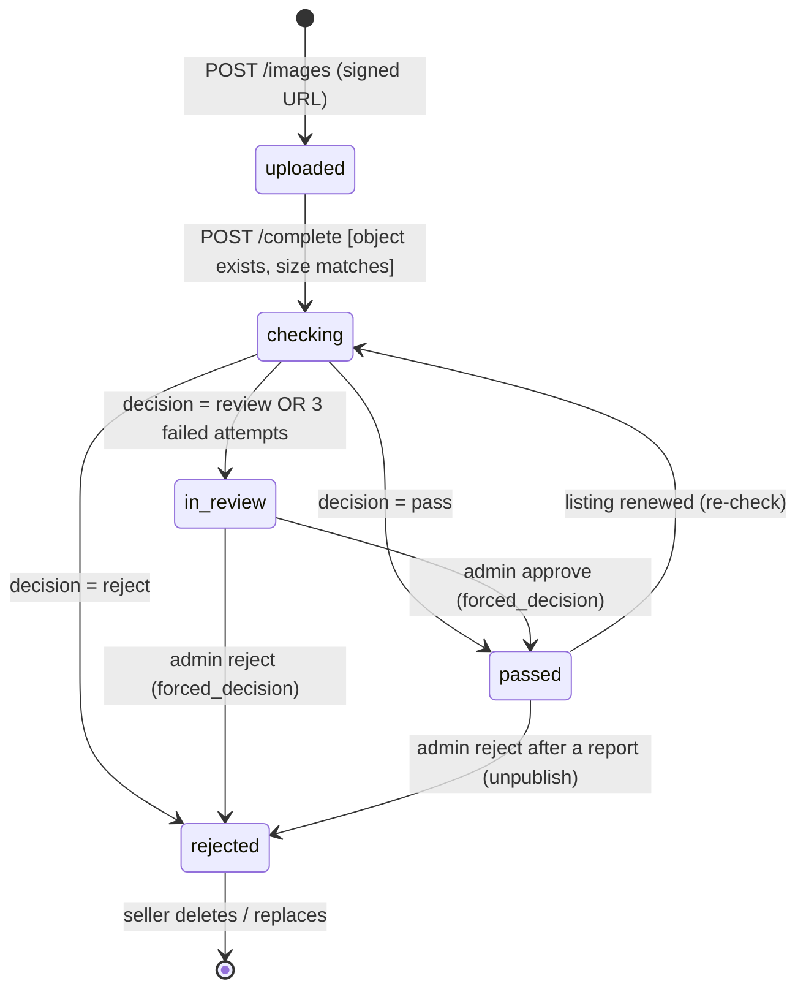
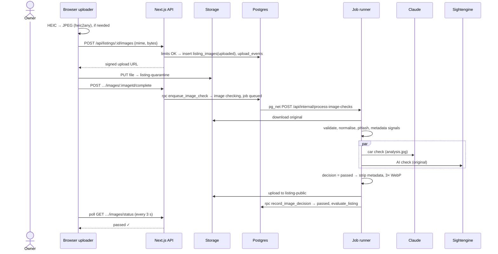

# System Spec: Image Verification Pipeline

> Source: `issues/prd-carmart.md` (Q3, Q4, Q16; AC-10, AC-18 to AC-29, AC-33), ADR-003, ADR-004, ADR-006, ADR-007, ADR-009
> Status: draft

## Overview
Every listing photo is checked before anyone but its owner can see it. The pipeline confirms the file is a real, readable image of adequate size. It checks whether the same photo is already used by a different shop, asks a vision model whether it shows a car, and asks an AI-detection vendor how likely it is to be AI-generated. It then decides `passed`, `rejected` or `in_review`. Passed photos are stripped of all metadata, converted to WebP in three sizes and published. Uncertain photos go to the admin review queue. The pipeline can't guarantee that no AI image ever passes (ADR-003). It guarantees that every photo is checked, and that suspicious ones are blocked or reviewed.

**Actors:**
| Actor | Role |
|---|---|
| Owner | Uploads photos and reads their status |
| Job runner | `src/server/jobs/image-verification/` (Node, `sharp`) |
| Car-check provider | Claude vision (`claude`) or `fake` |
| AI-check provider | Sightengine (`sightengine`) or `fake` (Hive later, ADR-013) |
| Admin | Decides `in_review` photos (forced decision) |

## State Machine

### Photo states (`listing_images.status`)
| State | Description | Visible to |
|---|---|---|
| `uploaded` | Row created, signed URL issued; the file may not exist yet | Owner |
| `checking` | Upload confirmed, job queued or running | Owner |
| `passed` | All checks passed (or an admin approved); public variants exist | Public (if the listing is visible) |
| `rejected` | Clear fail (or an admin rejected); reason shown to the seller | Owner |
| `in_review` | Uncertain; waiting for an admin | Owner (+ admin) |

### Job states (`image_checks.state`)
`queued → running → done`. Or `running → queued` (retryable error, attempts < 3). Or `running → failed` (the image goes to `in_review`).

### Mermaid diagram


### Transition table
| From | Event | Guard | Action | To |
|---|---|---|---|---|
| — | `request_upload` | owner; listing ∈ {draft, rejected, expired, live}; non-deleted photos < 20; shop uploads in last 24 h < `daily_upload_limit`; mime ∈ jpeg/png/webp; bytes ≤ 10 MB | insert image; insert `upload_events`; signed upload URL (2 min) | `uploaded` |
| `uploaded` | `complete` | owner; the object exists in quarantine; its size equals the declared `bytes` | `enqueue_image_check()` → `image_checks(queued)`; the trigger fires `pg_net` | `checking` |
| `checking` | `job_decided` | the job's `image_id` matches and the image isn't deleted | write the results; if pass → publish variants; `evaluate_listing` | `passed` / `rejected` / `in_review` |
| `checking` | `job_exhausted` | attempts = 3 | decision `in_review`, reason "Automatic check unavailable, under manual review" | `in_review` |
| `in_review` | `admin_approve` | `is_admin()` | new job with `forced_decision = passed` (publish only; no vendor calls); audit | `passed` |
| `in_review`, `passed` | `admin_reject` | `is_admin()`; reason | image `rejected`; if it was passed → `unpublish-image`; audit; `evaluate_listing` | `rejected` |
| `passed`, `rejected`, `in_review` | `recheck` | the listing is renewed (`expired → checking`) | new job `queued` | `checking` |
| any | `owner_delete` | owner; not leaving a live listing with < 4 passed | `deleted_at = now()`; if passed → `unpublish-image`; `evaluate_listing` | (soft-deleted) |

### Terminal states
Soft-deleted photos (`deleted_at` set) are terminal. `rejected` photos stay in place until the owner deletes them (their reason stays visible).

## Pipeline steps (job runner)

Each run claims a job (`UPDATE … SET state='running', locked_at=now(), attempts=attempts+1 WHERE id = (SELECT id … WHERE state='queued' ORDER BY created_at FOR UPDATE SKIP LOCKED LIMIT 1) RETURNING *`), then:

1. **Load**: the image row. If it's deleted, or the listing is `removed`, → job `done`, no decision (skip).
2. **Forced decision**: if `forced_decision` is set, skip to step 9 (publish) or step 10 (unpublish).
3. **Settings**: read the thresholds from `app_settings` once, at job start.
4. **Download**: the original from `listing-quarantine`.
5. **Validate** (`sharp().metadata()`):
   - The decoded format must be jpeg, png or webp, matching the declared mime family. Otherwise → **reject**, "We couldn't read this file as a photo."
   - Width × height must be ≥ 800 × 600 (either orientation). Otherwise → **reject**, "Photo is too small (minimum 800×600)."
   - Animated images → **reject**, "Animated images aren't allowed."
   - Store `width` and `height`.
6. **Normalise**: auto-rotate by EXIF orientation. Flatten transparency onto white. Produce `analysis.jpg` (long edge 1568 px, quality 85) for the vision model and the pHash.
7. **Signals** (recorded, never decisive alone):
   - `metadata_signals` from the **original** (EXIF present? camera make/model, software tag, C2PA manifest present?)
   - `phash` (64-bit DCT pHash of `analysis.jpg`)
   - Search other shops' non-deleted photos in `passed`/`in_review`/`checking` with Hamming distance ≤ `phash_max_distance`. On a match, record `phash_match`, which forces `in_review`.
8. **Vendor checks**, run in parallel with `Promise.all`, each with a 20 s timeout:
   - **Car check** on `analysis.jpg` → `CarCheckResult`
   - **AI check** on the **original bytes**, since detectors may use artifacts that re-encoding destroys → `AiCheckResult`

   On a vendor error or timeout: if `attempts < 3`, set the job back to `queued` (the next run is a pg_cron tick at least 1 minute later) with `last_error` stored. Otherwise → decision `in_review` (exhausted).
9. **Decide** (the decision table below). If `passed`: strip all metadata (`sharp` without `.withMetadata()`), encode WebP `sm` (400 px long edge, q75), `md` (1024, q80) and `lg` (1600, q82), then upload them to `listing-public/{listing_id}/{image_id}-{size}.webp`. Upload before updating the database, so a public path never points at a missing file.
10. **Commit** (one transaction through the `record_image_decision` RPC): write the `image_checks` results; update `listing_images.status`, `status_reason` and `public_paths`; call `evaluate_listing`; mark the job `done`.

## Business Rules and Invariants

### Hard invariants (never violate)
- [ ] **INV-I1:** No photo is readable by anyone except its owner and admins unless `status = 'passed'`. Quarantine is private, and only the job runner writes to `listing-public`.
- [ ] **INV-I2:** No public file contains EXIF, GPS, XMP or IPTC metadata.
- [ ] **INV-I3:** Every non-forced decision stores both vendor results (or the error that made the image `in_review`), plus the thresholds used.
- [ ] **INV-I4:** At most one open (`queued`/`running`) job per image (partial unique index). Re-running a `done` job changes nothing (idempotent).
- [ ] **INV-I5:** A vendor error can never produce `passed`.
- [ ] **INV-I6:** Tests and CI never call a paid vendor (the `fake` providers are enforced by `jobsEnv`).
- [ ] **INV-I7:** Only listing photos can ever be uploaded anywhere in the app (AC-10).

### Decision table (ADR-009; values from `app_settings`)
Evaluate every row. The **worst** outcome wins (rejected > in_review > passed). Reasons from every triggered row are collected, and the first rejected reason is shown to the seller.

| # | Condition | Outcome | Seller-facing reason |
|---|---|---|---|
| D1 | Validation failed (step 5) | rejected | (from step 5) |
| D2 | `ai.score ≥ ai_reject_threshold` (0.90) | rejected | "This photo appears to be AI-generated or digitally created. Please upload a real photo of the car." |
| D3 | `ai_review_threshold ≤ ai.score < ai_reject_threshold` | in_review | "We're double-checking this photo. This usually takes less than a day." |
| D4 | `car.is_car = false AND car.confidence ≥ car_reject_confidence` (0.85) | rejected | "This photo doesn't show a car. Only photos of the car for sale are allowed." |
| D5 | `car.is_car = false AND car.confidence < car_reject_confidence` | in_review | (D3 reason) |
| D6 | `car.is_car = true AND car.confidence < car_pass_confidence` (0.80) | in_review | (D3 reason) |
| D7 | `car.is_screen_or_print = true` | in_review | (D3 reason) |
| D8 | `phash_match` present (a different shop) | in_review | (D3 reason) |
| D9 | Vendor failure after 3 attempts | in_review | "Automatic check unavailable, under manual review." |
| D10 | None of the above | passed | — |

`car.view` ∈ {`exterior`, `interior`, `engine`, `dashboard`, `wheel_detail`, `other_car_detail`}. All of these count as car photos. The view is stored for future use (for example, "must include one exterior shot"), but isn't enforced in v1.

### Provider contracts (`src/server/jobs/image-verification/providers/types.ts`)
```typescript
export type CarCheckResult = {
  provider: 'claude' | 'fake'
  isCar: boolean
  confidence: number            // 0–1
  view: 'exterior' | 'interior' | 'engine' | 'dashboard' | 'wheel_detail' | 'other_car_detail' | 'not_car'
  isScreenOrPrint: boolean
  plateVisible: boolean
  faceVisible: boolean
  notes: string                 // ≤ 200 chars, internal only
}
export type AiCheckResult = { provider: 'sightengine' | 'fake'; score: number; raw: unknown }

export interface CarCheckProvider { check(jpeg: Buffer): Promise<Result<CarCheckResult, AppError>> }
export interface AiCheckProvider { check(original: Buffer, mime: string): Promise<Result<AiCheckResult, AppError>> }
```

**Claude car check:** a Messages API call with the image as base64 plus a fixed system prompt. The prompt says to judge only what is visible; that a real car (any part) counts; and that toys, models, drawings, renders, video-game cars, trucks, buses, motorbikes, caravans, boats and car parts on their own don't count. The model is forced to return JSON matching the schema above (tool-use / structured output, with the response validated by Zod). Invalid JSON is retried once, then treated as a vendor error. Model: `ANTHROPIC_CAR_CHECK_MODEL`.

**Sightengine AI check:** `POST https://api.sightengine.com/1.0/check.json`, multipart with `media` = the original bytes, `models=genai`, `api_user`, `api_secret`. The score comes from `type.ai_generated` (0–1). A response with `status != "success"` is a vendor error.

**Hive AI check:** deferred. The `AiCheckProvider` interface and the `AI_CHECK_PROVIDER=hive` switch are designed for it, but the Hive provider isn't built in v1 (ADR-013). Adding it later is one new provider file plus its tests.

**Fake providers (tests and local):** the result is chosen by a marker in the image, via a lookup table of known fixture pHashes in `tests/fixtures/images/manifest.json`, for example `car-exterior.jpg → isCar true 0.97, ai 0.02`, `dog.jpg → isCar false 0.95`, `ai-car.jpg → ai 0.95`, `borderline-ai.jpg → ai 0.7`, `screen-photo.jpg → isScreenOrPrint true`, `vendor-error.jpg → error`. Unknown images pass by default in local dev and **fail the test** in CI (strict mode), so fixtures stay explicit.

### Computed values
| Value | How calculated | When recalculated |
|---|---|---|
| `phash` | 64-bit DCT pHash of the normalised 1568 px JPEG | Each check |
| Hamming distance | `bit_count(phash # candidate)` in SQL | Each check |
| Photo counts on the listing | non-deleted photos by status | On read and in `evaluate_listing` |

## Sequence Diagrams

### Happy path


### Alternative path: uncertain → admin
Decision `in_review` → the photo stays private → it appears in `/admin/images` with the quarantine preview (signed URL), both vendor results, the metadata signals and any pHash match. The admin approves (forced job → publish → `evaluate_listing`) or rejects with a reason.

### Error path: vendor outage
The Sightengine call times out → `attempts = 1` → job requeued → the next pg_cron tick retries → after 3 failures → `in_review` (D9). The listing never goes live on an error.

## Edge Cases

| ID | Scenario | How it arises | Required behaviour | Error returned |
|---|---|---|---|---|
| EC-I1 | `complete` called before the upload finished | Race | Object missing | `409 UPLOAD_MISSING` |
| EC-I2 | Uploaded object larger than declared | Tampering | Delete the object; image `rejected` "Upload didn't match" | `409 UPLOAD_MISSING` |
| EC-I3 | File is a renamed PDF/GIF | Tampering | D1 reject (decoded format check) | — |
| EC-I4 | Photo deleted while its job runs | Seller deletes | Commit step sees `deleted_at`; discard results; delete any variants just uploaded | — |
| EC-I5 | Listing removed while jobs run | Admin | Skip; no publish | — |
| EC-I6 | Job runner crashes mid-job | Deploy or timeout | `requeue_stale_checks` after 5 min; attempts already counted | — |
| EC-I7 | Same photo reused by the **same** shop (relisting) | Legit | No pHash flag (match restricted to other shops) | — |
| EC-I8 | Thresholds changed during a job | Admin edits settings | The job uses values read at step 3; the next jobs use the new values | — |
| EC-I9 | `pg_net` delivers the same trigger twice | Retries | Claiming with SKIP LOCKED + the done-state check makes the second call a no-op | — |
| EC-I10 | 60-upload limit reached mid-batch | Big batch | Remaining requests → 429; the UI shows remaining quota | `429 UPLOAD_LIMIT` |
| EC-I11 | Claude returns malformed JSON | Model error | Retry once in-call; then treat as a vendor error (counts toward attempts) | — |
| EC-I12 | Photo shows a number plate or a face | Normal | Pass as usual; store `plate_visible`/`face_visible` for future blurring | — |

## Data Requirements

| Field | Table | Type | Purpose | Indexed? |
|---|---|---|---|---|
| `status`, `status_reason`, `public_paths`, `phash`, `width`, `height`, `deleted_at` | listing_images | — | photo state and public files | see schema |
| `state`, `attempts`, `locked_at`, `forced_decision`, `car_check`, `ai_check`, `metadata_signals`, `phash_match`, `decision`, `decision_reason`, `decided_by`, `last_error` | image_checks | — | job + evidence | queue idx; one-open-job unique |
| `shop_id`, `created_at` | upload_events | — | daily limit | `(shop_id, created_at)` |
| threshold keys | app_settings | jsonb | decisions | PK |

## API Surface

| Method | Path | Actor | Description |
|---|---|---|---|
| POST | `/api/listings/:id/images` | Owner | Request an upload URL |
| POST | `/api/listings/:id/images/:imageId/complete` | Owner | Confirm the upload and start the checks |
| GET | `/api/listings/:id/images/status` | Owner | Poll the status |
| DELETE | `/api/listings/:id/images/:imageId` | Owner | Soft-delete |
| PUT | `/api/listings/:id/images/order` | Owner | Reorder |
| GET | `/api/admin/queues/images` | Admin | Review queue |
| POST | `/api/admin/images/:id/approve`, `/reject` | Admin | Forced decisions |
| PATCH | `/api/admin/settings` | Admin | Thresholds |
| POST | `/api/internal/process-image-checks` | System | Run jobs |
| POST | `/api/internal/unpublish-image` | System | Remove public variants |

## Implementation Notes for the Agent

- Keep the **decision table a pure function**: `decide(inputs, settings) → { outcome, reasons[] }` in `src/server/jobs/image-verification/decide.ts`. Unit-test every row and every band edge (0.49, 0.50, 0.89, 0.90; confidence 0.79/0.80 and 0.84/0.85).
- Keep `sharp` work in `process-image.ts` (validate, normalise, pHash, strip + variants), and test it with the real fixture files (no mocking of `sharp`).
- Providers are the only code that calls vendors. Tests use `fake` only. A manual script `scripts/smoke-image-vendors.ts` calls the real vendors with 3 fixtures for pre-launch checks, and never runs in CI.
- Before relying on `sharp`, verify that its output has no metadata: `exifr`/`sharp().metadata()` on the output must show no `exif`, `xmp` or `iptc` (an embedded sRGB ICC colour profile is allowed).
