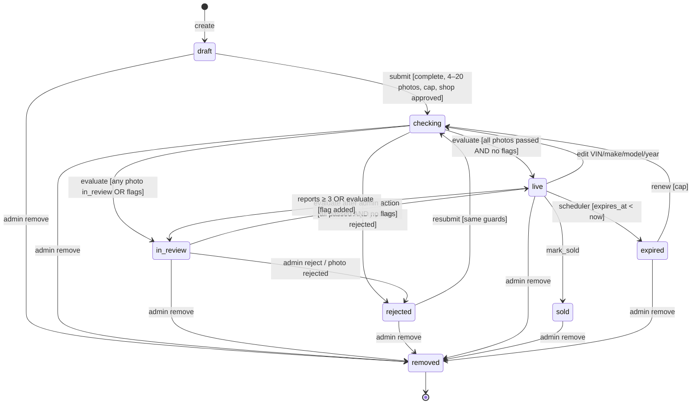
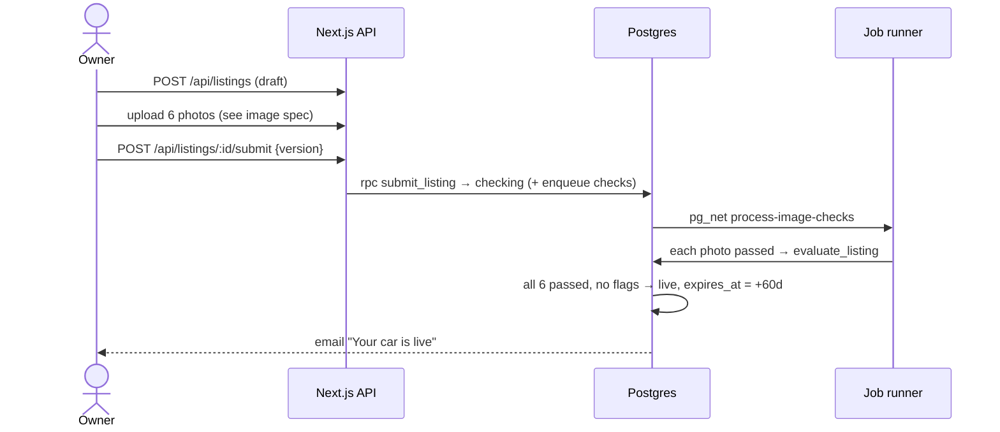

# System Spec: Listing Lifecycle

> Source: `issues/prd-carmart.md` (Q7, Q8, Q15; AC-11 to AC-17, AC-30 to AC-38)
> Status: draft

## Overview
Governs how a car listing moves from draft to live and on to sold, expired or removed. It covers the edit rules while live, VIN uniqueness, review flags and auto-hiding on reports. The listing's status depends on its photos' statuses (`docs/systems/image-verification.md`) and its review flags. A single SQL function, `evaluate_listing(listing_id)`, recomputes it whenever an input changes.

**Actors:**
| Actor | Role |
|---|---|
| Owner | Creates, edits, submits, marks sold, renews |
| Image pipeline (system) | Decides photos and calls `evaluate_listing` |
| Admin | Clears flags, rejects, removes, approves or rejects photos |
| Scheduler (system) | Expires listings, queues reminders, unpublishes old sold listings |
| Reporters | Enough open reports auto-hide a listing |

## State Machine

### States
| State | Description | Public? | Counts toward cap? |
|---|---|---|---|
| `draft` | Being prepared; may be incomplete | No | No |
| `checking` | Submitted; photos being verified | No | Yes |
| `in_review` | Waiting on an admin (see `review_flags`) | No | Yes |
| `rejected` | A photo clearly failed, or an admin rejected it; the seller can fix and resubmit | No | No |
| `live` | Visible in search and by URL | Yes | Yes |
| `sold` | Marked sold by the owner; SOLD banner, by URL only, for 7 days | By URL only (7 days) | No |
| `expired` | 60 days after going live; the owner can renew | No | No |
| `removed` | Admin takedown (terminal) | No | No |

### Mermaid diagram

### Transition table
| From | Event | Guard (must be true) | Action | To |
|---|---|---|---|---|
| — | `create` | owner of a non-suspended shop | insert `draft`, currency from shop | `draft` |
| `draft`, `rejected` | `submit` | owner; shop `approved`; all required fields valid; 4–20 non-deleted photos; active count < `listing_cap`; no *own* active listing with the same VIN | set `submitted_at`; add `duplicate_vin` flag if another shop's listing with this VIN is `checking`/`in_review`/`live`; add `other_make_model` if make/model is "Other"; enqueue checks for photos not yet `passed`; `evaluate_listing` | `checking` (then per evaluate) |
| `expired` | `renew` | owner; shop `approved`; cap | same as submit (re-checks the VIN duplicate); all photos are re-queued for checking (thresholds or vendors may have changed); `expires_at` reset when it goes live | `checking` |
| `checking`, `in_review` | `evaluate` | — | see **Evaluate rules** | `live` / `in_review` / `rejected` / unchanged |
| `live` | `edit_minor` | owner; fields ⊆ {colour, rego, rego_expiry, description, price_cents, odometer_km, suburb, postcode, state} | update; version++ | `live` |
| `live` | `edit_identity` | owner; any of {vin, make_*, model_*, year} changed | update; re-run the duplicate-VIN check; version++; `evaluate` | `checking` |
| `live` | `add_photo` | owner; total non-deleted ≤ 20 | photo `checking`; the listing **stays live**; the new photo stays private until it passes | `live` |
| `live` | `report_threshold` | ≥ `reports_auto_hide_count` open reports from distinct users | add flag `reports_threshold` | `in_review` |
| `live` | `mark_sold` | owner | `sold_at = now()` | `sold` |
| `live` | `expire` | scheduler; `expires_at < now()` | — | `expired` |
| any except `removed` | `admin_remove` | `is_admin()`; reason | `status_reason`; audit; unpublish photos; enqueue `listing_removed` | `removed` |
| `in_review` | `admin_reject` | `is_admin()`; reason | `status_reason`; clear flags; audit; enqueue `listing_rejected` | `rejected` |
| `in_review`, `live` | `admin_clear_flag(flag)` | `is_admin()`; flag present; if clearing `duplicate_vin`, no *other* listing with this VIN is `live` | remove flag; audit; `evaluate` | per evaluate |

Every other (state, event) pair → `409 INVALID_STATE`. `checking` and `in_review` listings can't be edited by the owner (`409 INVALID_STATE`).

### Evaluate rules: `evaluate_listing(listing_id)`
Considers only **non-deleted** photos. Applies to listings in `checking` or `in_review`. For `live` listings it only handles photo additions, as noted.

1. If any photo is `rejected` **and** the listing is `checking` or `in_review` → `rejected`, with `status_reason` = "One or more photos were rejected" (each photo shows its own reason). Enqueue `listing_rejected`.
2. Else if any photo is `uploaded` or `checking` → no change.
3. Else if any photo is `in_review` **or** `review_flags` is non-empty → `in_review` (enqueue `listing_in_review` on first entry only).
4. Else (all photos `passed`, count ≥ 4, no flags) → `live`. Set `live_at = now()`. Set `expires_at = now() + listing_expiry_days` if `expires_at` is null or in the past (first publication, or renewal). Otherwise keep it: an identity-edit re-check doesn't extend the clock. Enqueue `listing_live`.

For a **live** listing whose newly added photo is decided:
- `passed` → it becomes public; the listing is unchanged.
- `rejected` → it stays private; the seller sees the reason; the listing stays live.
- `in_review` → it stays private until an admin decides; the listing stays live.

### Terminal states
`removed` is the only terminal state: an admin takedown, with the reason kept. `sold` and `expired` are effectively ends of life, but `expired` can be renewed and `sold` just ages out of view.

## Business Rules and Invariants

### Hard invariants (never violate)
- [ ] **INV-L1:** At most one listing per VIN is `live` across CarMart (partial unique index on `vin WHERE status = 'live'`).
- [ ] **INV-L2:** A `live` listing has ≥ 4 non-deleted `passed` photos, and only `passed` photos are publicly readable.
- [ ] **INV-L3:** A listing is publicly visible only if its shop is `approved`.
- [ ] **INV-L4:** A listing with any non-empty `review_flags` is never `live`.
- [ ] **INV-L5:** A shop's listings in `checking`, `in_review` and `live` never exceed `listing_cap` (checked at submit and renew).
- [ ] **INV-L6:** Every status change increments `version` and happens inside a transition RPC.
- [ ] **INV-L7:** `removed` listings never change state again.

### Business rules (enforced per operation)
| Rule ID | Rule | Enforced at | Error if violated |
|---|---|---|---|
| BR-L1 | Required fields complete on submit | `listing.service` + `submit_listing` | `422 LISTING_INCOMPLETE` |
| BR-L2 | VIN format (17 chars, no I/O/Q). No check-digit validation (not used on most AU-market vehicles) | Zod + DB check | `422 INVALID_VIN` |
| BR-L3 | Body type is in the car-only enum | Zod + enum | `422 VALIDATION_ERROR` |
| BR-L4 | 4–20 photos | submit RPC; photo delete on live | `422 PHOTO_COUNT` |
| BR-L5 | Active cap | submit and renew RPCs | `422 LISTING_LIMIT_REACHED` |
| BR-L6 | The same shop can't have two active listings with the same VIN | submit RPC | `409 DUPLICATE_LISTING` |
| BR-L7 | Another shop's active listing with the VIN → `duplicate_vin` flag | submit RPC | — (goes to in_review) |
| BR-L8 | "Other" make or model → `other_make_model` flag | submit RPC | — |
| BR-L9 | Year 1900…current+1; km 0–2,000,000; price A$1–A$10m; postcode matches state | Zod + DB checks | `422 VALIDATION_ERROR` / `POSTCODE_STATE_MISMATCH` |
| BR-L10 | Optimistic lock: client `version` must match | RPCs | `409 VERSION_CONFLICT` |
| BR-L11 | Only approved shops can submit or renew | RPCs | `422 SHOP_NOT_APPROVED` |

### Computed values
| Value | How calculated | When recalculated |
|---|---|---|
| `title` | `{year} {make} {model}` (using `*_other` when set) | On read |
| `expires_at` | `live_at + listing_expiry_days` on first publication or renewal | On transition to `live` |
| Sold public visibility | `sold_at > now() - sold_visible_days` | On read (RLS) |
| Active count | listings in `checking`, `in_review`, `live` | On submit and renew |

## Sequence Diagrams

### Happy path

### Alternative path: duplicate VIN
Shop B submits a VIN that Shop A has live → `duplicate_vin` flag → photos pass → `in_review`. An admin sees both side by side and either removes one (then clears the flag, and B's listing re-evaluates to `live`) or rejects B's listing with a reason.

### Error path: reports on a live listing
The third distinct open report → `live → in_review` (`reports_threshold`), and the listing is hidden. The admin dismisses the reports and clears the flag → `live` (the expiry clock is unchanged). Or the admin removes the listing → `removed`.

## Edge Cases

| ID | Scenario | How it arises | Required behaviour | Error returned |
|---|---|---|---|---|
| EC-L1 | Concurrent edits | Two browser tabs | Optimistic lock on `version` | `409 VERSION_CONFLICT` |
| EC-L2 | Owner edits while `checking` | Impatient seller | Refused until the result arrives | `409 INVALID_STATE` |
| EC-L3 | Owner deletes photos on a live listing down to 3 passed | Cleanup | Refused | `422 PHOTO_COUNT` |
| EC-L4 | Identity edit on live creates a VIN clash | New VIN is live elsewhere | → `checking` with `duplicate_vin` → `in_review` | — |
| EC-L5 | Shop suspended while listings are live | Admin suspension | Listings stay `live` in the DB but vanish publicly (INV-L3); unsuspend restores them | — |
| EC-L6 | Listing expires while `in_review` | Admin backlog | Expiry applies only to `live`; the `in_review` clock doesn't run | — |
| EC-L7 | Renewal hits the cap | Many active listings | Refused | `422 LISTING_LIMIT_REACHED` |
| EC-L8 | Admin clears `duplicate_vin` while the other listing is still live | Admin error | Refused (INV-L1) | `409 VIN_STILL_LIVE` |
| EC-L9 | Photo check job fails permanently | Vendor outage | Photo → `in_review` (never auto-live) | — |
| EC-L10 | Sold listing reported | Buyer complaint | Report accepted; admin can remove; no auto-hide on sold | — |
| EC-L11 | Two submits race on the last cap slot | Double click | Row lock on the shop in `submit_listing`; the second fails | `422 LISTING_LIMIT_REACHED` |

## Data Requirements

| Field | Table | Type | Purpose | Indexed? |
|---|---|---|---|---|
| `status`, `status_reason`, `review_flags` | listings | enum, text, review_flag[] | state and reasons | `(shop_id, status)` |
| `vin` | listings | char(17) | uniqueness and duplicate detection | unique partial `WHERE status='live'` + btree on `vin` |
| `live_at`, `expires_at`, `expiry_reminder_sent_at`, `sold_at`, `submitted_at` | listings | timestamptz | clocks | `expires_at WHERE live` |
| `version` | listings | int | optimistic lock | no |
| `listing_cap` | shops | int | cap | no |
| `status`, `deleted_at` | listing_images | enum, timestamptz | evaluate inputs | `(listing_id, position)` |
| `target_*`, `status`, `reporter_id` | reports | — | auto-hide threshold | `(target_type, target_id) WHERE open` |

> Index note: uniqueness is enforced only among `live` listings (`listings_live_vin_key`), so duplicate submissions can wait in `in_review` for an admin (BR-L7).

## API Surface

| Method | Path | Actor | Description |
|---|---|---|---|
| POST | `/api/listings` | Owner | Create a draft |
| PATCH | `/api/listings/:id` | Owner | Edit (rules above) |
| DELETE | `/api/listings/:id` | Owner | Delete a draft |
| POST | `/api/listings/:id/submit` | Owner | Submit / resubmit |
| POST | `/api/listings/:id/renew` | Owner | Renew an expired listing |
| POST | `/api/listings/:id/mark-sold` | Owner | Sold |
| POST | `/api/reports` | User | May trigger auto-hide |
| POST | `/api/admin/listings/:id/clear-flag`, `/reject`, `/remove` | Admin | Review actions |
| POST | `/api/internal/unpublish-listing` | System | Delete public photo variants (removed, or sold past 7 days) |

## Implementation Notes for the Agent

- SQL functions: `submit_listing(id, version)`, `renew_listing(id, version)`, `mark_listing_sold(id, version)`, `update_listing_identity(...)`, `evaluate_listing(id)`, `admin_clear_listing_flag(id, flag, reason)`, `admin_reject_listing(id, reason)`, `admin_remove_listing(id, reason)`, `expire_listings()`, `queue_expiry_reminders()`.
- Always lock the listing row (`FOR UPDATE`), and the shop row for cap checks, in a single transaction.
- `evaluate_listing` must be idempotent and safe to call from any trigger path.
- Unpublishing: an `AFTER UPDATE` trigger on `listings.status → removed` calls `pg_net` → `/api/internal/unpublish-listing`. The daily job does the same for sold listings older than `sold_visible_days`.
- Test the transition table exhaustively (every row, and a sample of illegal pairs), every evaluate branch, and INV-L1 under concurrency.
