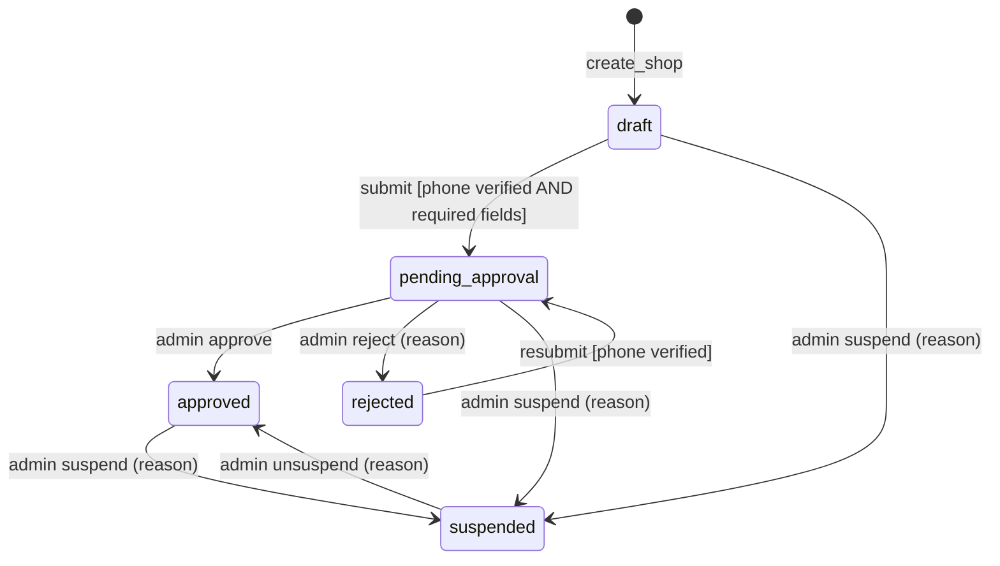
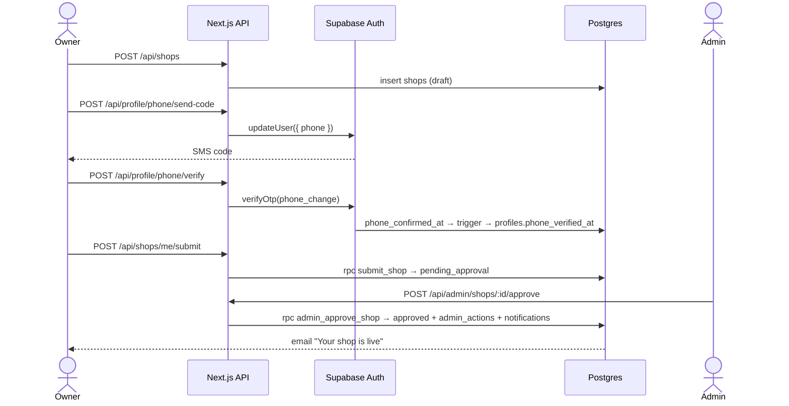

# System Spec: Shop Onboarding

> **Nigeria (ADR-015):** no postcode (state + city only), prices in naira (kobo), +234 mobiles, Nigerian plate numbers instead of "rego", `pickup` instead of `ute`, a required car condition, no PPSR (VIN shown for buyers to check), Nigerian law for legal pages. Where this file says otherwise, ADR-015 wins.

> Source: `issues/prd-carmart.md` (Q2, Q9, Q11, Q14; AC-04 to AC-10, AC-52)
> Status: draft

## Overview
Turns an ordinary user into a verified, publicly visible seller. Anyone can create one shop and draft listings immediately. The shop, and therefore every listing, becomes public only after the owner verifies an Nigerian mobile and an admin approves the shop. Admins can later suspend and unsuspend shops.

**Actors:**
| Actor | Role |
|---|---|
| Owner | A signed-in user with a verified email who creates and submits the shop |
| Admin | Approves, rejects, suspends and unsuspends |
| System | Sends emails (outbox) and hides listings on suspension |

## State Machine

### States
| State | Description | Publicly visible? |
|---|---|---|
| `draft` | Created, not yet submitted. The owner can edit everything and draft listings | No |
| `pending_approval` | Submitted, waiting for an admin | No |
| `approved` | Live and verified. Listings can be submitted and go live | Yes |
| `rejected` | An admin declined. The owner can fix and resubmit | No |
| `suspended` | An admin blocked it. All listings are hidden from search immediately | No |

### Mermaid diagram

### Transition table
| From | Event | Guard (must be true) | Action | To |
|---|---|---|---|---|
| — | `create_shop` | caller verified and active; caller has no shop; slug unique; postcode matches state | insert with `status = draft` | `draft` |
| `draft` | `submit` | owner; `profiles.phone_verified_at IS NOT NULL`; name, slug, city, state, postcode valid | set `submitted_at`; version++ | `pending_approval` |
| `rejected` | `submit` | same as above | clear `status_reason`; set `submitted_at`; version++ | `pending_approval` |
| `pending_approval` | `approve` | `is_admin()` | set `approved_at`; audit `shop.approve`; enqueue `shop_approved` | `approved` |
| `pending_approval` | `reject` | `is_admin()`; reason 5–500 chars | set `status_reason`; audit `shop.reject`; enqueue `shop_rejected` | `rejected` |
| `draft`, `pending_approval`, `approved` | `suspend` | `is_admin()`; reason | set `status_reason`; audit `shop.suspend` | `suspended` |
| `suspended` | `unsuspend` | `is_admin()`; reason; owner profile `active` | clear `status_reason`; audit `shop.unsuspend` | `approved` |

Every other (state, event) pair → `409 INVALID_STATE`.

### Terminal states
None. `rejected` can be resubmitted, and `suspended` can be unsuspended. There's no shop deletion in v1.

## Business Rules and Invariants

### Hard invariants (never violate)
- [ ] **INV-S1:** A profile owns at most one shop (`unique(owner_id)`).
- [ ] **INV-S2:** A shop in any state other than `approved` has no publicly visible listings (RLS on `listings` joins `shops.status = 'approved'`).
- [ ] **INV-S3:** A shop reaches `pending_approval` only if its owner's phone was verified at the time of submission.
- [ ] **INV-S4:** Every admin transition writes exactly one `admin_actions` row in the same transaction.
- [ ] **INV-S5:** `slug` can't change once a shop has ever been `approved` (the SEO URL is stable).

### Business rules (enforced per operation)
| Rule ID | Rule | Enforced at | Error if violated |
|---|---|---|---|
| BR-S1 | Only one shop per account | `shop.service` + unique index | `409 SHOP_ALREADY_EXISTS` |
| BR-S2 | Slug format and uniqueness | Zod + unique index | `422 VALIDATION_ERROR` / `409 SLUG_TAKEN` |
| BR-S3 | Postcode consistent with state | `src/lib/au-postcode.ts` | `422 POSTCODE_STATE_MISMATCH` |
| BR-S4 | Submission requires a verified phone | `submit_shop` RPC | `422 PHONE_NOT_VERIFIED` |
| BR-S5 | Slug is editable only in `draft`/`rejected` and never after the first approval | service + RPC | `409 SLUG_LOCKED` |
| BR-S6 | Listings may be drafted in any non-suspended shop state, but **submitted** only when the shop is `approved` | `submit_listing` RPC | `422 SHOP_NOT_APPROVED` |
| BR-S7 | Suspending a user also suspends their shop | `moderation.service` | — |
| BR-S8 | Rejection and suspension require a reason (5–500 chars) | Zod + RPC | `422 REASON_REQUIRED` |

### Computed values
| Value | How calculated | When recalculated |
|---|---|---|
| `verified` (badge) | `status = 'approved' AND owner.phone_verified_at IS NOT NULL` | On read |
| `active_listing_count` | count of listings in `checking`, `in_review`, `live` | On read |

### Postcode ↔ state ranges (`src/lib/au-postcode.ts`)
| State | Valid postcode ranges |
|---|---|
| NSW | 1000–2599, 2619–2899, 2921–2999 |
| ACT | 0200–0299, 2600–2618, 2900–2920 |
| VIC | 3000–3999, 8000–8999 |
| QLD | 4000–4999, 9000–9999 |
| SA | 5000–5999 |
| WA | 6000–6999 |
| TAS | 7000–7999 |
| NT | 0800–0999 |

## Sequence Diagrams

### Happy path

### Alternative path: rejection and resubmission
Admin rejects with a reason → `rejected` + email with the reason → the owner edits (slug still editable) → submits again → `pending_approval`.

### Error path
- Submit without a verified phone → `422 PHONE_NOT_VERIFIED`, and the UI links to `/sell/phone`.
- A second shop → `409 SHOP_ALREADY_EXISTS`.
- Two admins act on the same pending shop at once → the second gets `409 INVALID_STATE` (row lock + state check in the RPC).

## Edge Cases

| ID | Scenario | How it arises | Required behaviour | Error returned |
|---|---|---|---|---|
| EC-S1 | Phone already verified on another account | Seller reuses a number | Refuse to send the code | `409 PHONE_IN_USE` |
| EC-S2 | Owner changes phone after approval | New OTP flow | The shop stays approved; `phone_verified_at` is updated only after the new code verifies; the badge stays | — |
| EC-S3 | Concurrent admin decisions | Two admins | `SELECT … FOR UPDATE`; the second sees the new state | `409 INVALID_STATE` |
| EC-S4 | User suspended while the shop is pending | Admin suspends the user | The shop → `suspended` too; the pending queue no longer lists it | — |
| EC-S5 | Unsuspend a shop whose owner is still suspended | Admin error | Refused | `409 OWNER_SUSPENDED` |
| EC-S6 | Slug collision on submit from another shop's rename | Race | Unique index; the second writer gets a conflict | `409 SLUG_TAKEN` |

## Data Requirements

| Field | Table | Type | Purpose | Indexed? |
|---|---|---|---|---|
| `owner_id` | shops | uuid | one shop per owner | unique |
| `slug` | shops | text | public URL | unique |
| `status`, `submitted_at` | shops | shop_status, timestamptz | state + queue order | `(status, submitted_at)` |
| `status_reason`, `approved_at` | shops | text, timestamptz | reasons, stable-slug rule | no |
| `phone_verified_at` | profiles | timestamptz | submit guard, badge | no |
| `actor_id`, `action`, `target_*`, `reason` | admin_actions | — | audit | yes |

## API Surface

| Method | Path | Actor | Description |
|---|---|---|---|
| POST | `/api/shops` | Owner | Create a draft shop |
| PATCH | `/api/shops/me` | Owner | Edit fields |
| POST | `/api/shops/me/submit` | Owner | Submit or resubmit |
| POST | `/api/profile/phone/send-code`, `/verify` | Owner | Phone OTP |
| GET | `/api/admin/queues/shops` | Admin | Pending queue |
| POST | `/api/admin/shops/:id/approve`, `/reject`, `/suspend`, `/unsuspend` | Admin | Transitions |

## Implementation Notes for the Agent

- Transitions live in SQL: `submit_shop()`, `admin_approve_shop(id)`, `admin_reject_shop(id, reason)`, `admin_suspend_shop(id, reason)`, `admin_unsuspend_shop(id, reason)`. Each one locks the row, validates the transition table, increments `version`, writes `admin_actions` and enqueues the notification, all in one transaction.
- `shop.service` and `moderation.service` call these RPCs and map SQL errors (`raise exception using errcode = 'P0001', message = 'INVALID_STATE'`) to `AppError` codes.
- Test each transition row and each "every other pair → INVALID_STATE" case.
