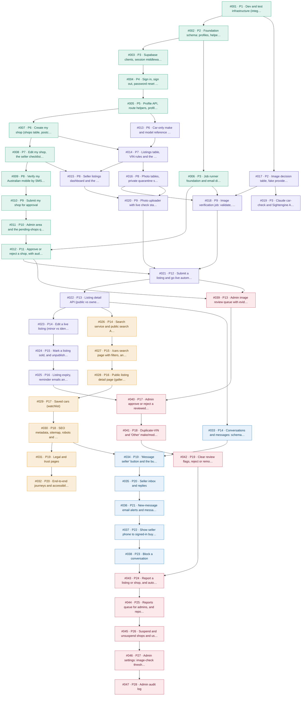

# Execution Plan

> Generated from `issues/open/` by /plan-issues. Regenerate with `/plan-issues` if issues change.

**Total issues:** 47 AFK + 0 Human-in-loop
**Phases:** 28
**Peak parallel worktrees:** 3 (Phases 3, 8, 9, 14, 19)
**Shape:** mostly sequential by design. Shared files (listing.service, moderation.service, the car page, templates) and redefined SQL functions are chained through blockers, so parallel worktrees never edit the same file.

## Dependency Graph



Colours = epics (green E01 shops, purple E02 listings/photos, amber E03 search, blue E04 messaging, red E05 moderation). `P#` = phase.

## Phase 1 — 1 issue, no blockers

| # | Title | Branch | Priority |
|---|---|---|---|
| 001 | Dev and test infrastructure (integration harness, CI, lint guard, Playwright) | feature/001-dev-test-infrastructure | critical |

```bash
./scripts/worktree-run.sh 1
```

## Phase 2 — 2 issues, blocked by #001

| # | Title | Branch | Priority |
|---|---|---|---|
| 002 | Foundation schema: profiles, helper functions, settings, audit log, email outbox | feature/002-foundation-schema | critical |
| 017 | Image decision table, fake providers and test fixtures | feature/017-image-decision-table-and-fakes | critical |

```bash
./scripts/worktree-run.sh 2
```

## Phase 3 — 3 issues, blocked by #002, #017

| # | Title | Branch | Priority |
|---|---|---|---|
| 003 | Supabase clients, session middleware and the sign-up flow | feature/003-supabase-clients-and-sign-up | high |
| 006 | Job runner foundation and email dispatch (log provider) | feature/006-job-runner-and-email-dispatch | high |
| 019 | Claude car-check and Sightengine AI-check providers | feature/019-real-image-check-providers | high |

```bash
./scripts/worktree-run.sh 3
```

## Phase 4 — 1 issue, blocked by #003

| # | Title | Branch | Priority |
|---|---|---|---|
| 004 | Sign in, sign out, password reset and the site header | feature/004-sign-in-reset-header | high |

```bash
./scripts/worktree-run.sh 4
```

## Phase 5 — 1 issue, blocked by #004

| # | Title | Branch | Priority |
|---|---|---|---|
| 005 | Profile API, route helpers, profile page and suspended-account handling | feature/005-profile-api-and-suspension | high |

```bash
./scripts/worktree-run.sh 5
```

## Phase 6 — 2 issues, blocked by #005

| # | Title | Branch | Priority |
|---|---|---|---|
| 007 | Create my shop (shops table, postcode rules, create form) | feature/007-create-shop | high |
| 013 | Car-only make and model reference data | feature/013-vehicle-reference-data | high |

```bash
./scripts/worktree-run.sh 6
```

## Phase 7 — 2 issues, blocked by #007, #013

| # | Title | Branch | Priority |
|---|---|---|---|
| 008 | Edit my shop, the seller checklist and the public shop page | feature/008-edit-shop-and-public-page | high |
| 014 | Listings table, VIN rules and the draft API | feature/014-listings-table-and-draft-api | high |

```bash
./scripts/worktree-run.sh 7
```

## Phase 8 — 3 issues, blocked by #008, #014

| # | Title | Branch | Priority |
|---|---|---|---|
| 009 | Verify my Australian mobile by SMS code | feature/009-phone-verification | high |
| 015 | Seller listings dashboard and the car listing form | feature/015-listing-draft-form | high |
| 016 | Photo tables, private quarantine storage and the upload API | feature/016-photo-upload-api | critical |

```bash
./scripts/worktree-run.sh 8
```

## Phase 9 — 3 issues, blocked by #006, #009, #015, #016, #017

| # | Title | Branch | Priority |
|---|---|---|---|
| 010 | Submit my shop for approval | feature/010-submit-shop-for-approval | high |
| 018 | Image verification job: validate, fingerprint, check, decide, clean and publish | feature/018-image-verification-pipeline | critical |
| 020 | Photo uploader with live check status, HEIC conversion and reordering | feature/020-photo-uploader-ui | high |

```bash
./scripts/worktree-run.sh 9
```

## Phase 10 — 1 issue, blocked by #010

| # | Title | Branch | Priority |
|---|---|---|---|
| 011 | Admin area and the pending-shops queue | feature/011-admin-area-and-shop-queue | high |

```bash
./scripts/worktree-run.sh 10
```

## Phase 11 — 1 issue, blocked by #006, #011

| # | Title | Branch | Priority |
|---|---|---|---|
| 012 | Approve or reject a shop, with audit log and emails | feature/012-admin-approve-reject-shop | high |

```bash
./scripts/worktree-run.sh 11
```

## Phase 12 — 1 issue, blocked by #012, #018, #020

| # | Title | Branch | Priority |
|---|---|---|---|
| 021 | Submit a listing and go live automatically | feature/021-submit-listing-and-go-live | critical |

```bash
./scripts/worktree-run.sh 12
```

## Phase 13 — 2 issues, blocked by #012, #021

| # | Title | Branch | Priority |
|---|---|---|---|
| 022 | Listing detail API (public vs owner) and listing status emails | feature/022-listing-view-api-and-emails | high |
| 039 | Admin image review queue with evidence | feature/039-admin-image-review-queue | high |

```bash
./scripts/worktree-run.sh 13
```

## Phase 14 — 3 issues, blocked by #022

| # | Title | Branch | Priority |
|---|---|---|---|
| 023 | Edit a live listing (minor vs identity changes, live photo rules) | feature/023-edit-live-listing | high |
| 026 | Search service and public search API | feature/026-search-service-and-api | high |
| 033 | Conversations and messages: schema, rules and API | feature/033-conversations-schema-and-service | high |

```bash
./scripts/worktree-run.sh 14
```

## Phase 15 — 2 issues, blocked by #023, #026

| # | Title | Branch | Priority |
|---|---|---|---|
| 024 | Mark a listing sold, and unpublish removed or old sold listings | feature/024-mark-sold-and-unpublish | normal |
| 027 | /cars search page with filters, and the home page | feature/027-cars-search-page-and-home | high |

```bash
./scripts/worktree-run.sh 15
```

## Phase 16 — 2 issues, blocked by #024, #027

| # | Title | Branch | Priority |
|---|---|---|---|
| 025 | Listing expiry, reminder emails and renewal | feature/025-expiry-reminders-and-renew | normal |
| 028 | Public listing detail page (gallery, specs, VIN/PPSR, shop card, SOLD) | feature/028-listing-detail-page | high |

```bash
./scripts/worktree-run.sh 16
```

## Phase 17 — 2 issues, blocked by #025, #028, #039

| # | Title | Branch | Priority |
|---|---|---|---|
| 029 | Saved cars (watchlist) | feature/029-saved-cars | normal |
| 040 | Admin approve or reject a reviewed photo | feature/040-admin-approve-reject-photo | high |

```bash
./scripts/worktree-run.sh 17
```

## Phase 18 — 2 issues, blocked by #029, #040

| # | Title | Branch | Priority |
|---|---|---|---|
| 030 | SEO metadata, sitemap, robots and site footer | feature/030-seo-metadata-footer | normal |
| 041 | Duplicate-VIN and 'Other' make/model review queues | feature/041-admin-listing-review-queues | normal |

```bash
./scripts/worktree-run.sh 18
```

## Phase 19 — 3 issues, blocked by #030, #033, #041

| # | Title | Branch | Priority |
|---|---|---|---|
| 031 | Legal and trust pages | feature/031-legal-and-trust-pages | normal |
| 034 | 'Message seller' button and the buyer inbox | feature/034-message-seller-ui-and-buyer-inbox | high |
| 042 | Clear review flags, reject or remove listings | feature/042-admin-listing-actions | high |

```bash
./scripts/worktree-run.sh 19
```

## Phase 20 — 2 issues, blocked by #031, #034

| # | Title | Branch | Priority |
|---|---|---|---|
| 032 | End-to-end journeys and accessibility checks | feature/032-e2e-journeys-and-accessibility | normal |
| 035 | Seller inbox and replies | feature/035-seller-inbox | high |

```bash
./scripts/worktree-run.sh 20
```

## Phase 21 — 1 issue, blocked by #035

| # | Title | Branch | Priority |
|---|---|---|---|
| 036 | New-message email alerts and message rate limit | feature/036-message-email-alerts | normal |

```bash
./scripts/worktree-run.sh 21
```

## Phase 22 — 1 issue, blocked by #036

| # | Title | Branch | Priority |
|---|---|---|---|
| 037 | Show seller phone to signed-in buyers (opt-in) | feature/037-show-seller-phone | normal |

```bash
./scripts/worktree-run.sh 22
```

## Phase 23 — 1 issue, blocked by #037

| # | Title | Branch | Priority |
|---|---|---|---|
| 038 | Block a conversation | feature/038-block-conversation | normal |

```bash
./scripts/worktree-run.sh 23
```

## Phase 24 — 1 issue, blocked by #038, #042

| # | Title | Branch | Priority |
|---|---|---|---|
| 043 | Report a listing or shop, and auto-hide at 3 reports | feature/043-reports-and-auto-hide | high |

```bash
./scripts/worktree-run.sh 24
```

## Phase 25 — 1 issue, blocked by #043

| # | Title | Branch | Priority |
|---|---|---|---|
| 044 | Reports queue for admins, and reporting conversations | feature/044-reports-queue-and-conversation-reports | normal |

```bash
./scripts/worktree-run.sh 25
```

## Phase 26 — 1 issue, blocked by #044

| # | Title | Branch | Priority |
|---|---|---|---|
| 045 | Suspend and unsuspend shops and users, and set listing caps | feature/045-suspensions-and-listing-caps | high |

```bash
./scripts/worktree-run.sh 26
```

## Phase 27 — 1 issue, blocked by #045

| # | Title | Branch | Priority |
|---|---|---|---|
| 046 | Admin settings: image-check thresholds and limits | feature/046-admin-settings | normal |

```bash
./scripts/worktree-run.sh 27
```

## Phase 28 — 1 issue, blocked by #046

| # | Title | Branch | Priority |
|---|---|---|---|
| 047 | Admin audit log | feature/047-audit-log | normal |

```bash
./scripts/worktree-run.sh 28
```

## Human-in-loop Issues — manual only

| # | Title | Run after | Notes |
|---|---|---|---|
| — | None | — | Every issue is AFK. Human tasks (vendor accounts, domain, legal review, threshold calibration) are in the launch checklist in `docs/architecture.md`. |

## Merge order summary

- Merge **all** PRs of Phase N (squash) before running Phase N+1.
- Within a phase, merge in **ascending issue number** so migration timestamps land in order.
- After each phase: `./scripts/worktree-merge.sh N && ./scripts/status.sh --write`.

## Conflict risk table

| Phase | Issues | Shared resource | Resolution |
|---|---|---|---|
| any | — | Files | No two issues in the same phase list the same file (checked automatically) |
| 9→17 | 018, 021, 022, 023, 025, 040 | SQL function `evaluate_listing` (create or replace) | Strictly sequential (040 is blocked by 025); each migration starts from the latest definition |
| 14→23 | 033, 036, 038 | SQL functions `send_message`, `start_conversation` | Sequential chain 033 → 034 → 035 → 036 → 037 → 038 |
| various | 013–025 | `src/services/listing.service.ts` | Every editor is in a different phase |
| various | 011, 012, 039–047 | `src/services/moderation.service.ts` (≤ 8 exports) | Sequential admin chain |
| various | 028, 029, 030, 034, 037, 043 | `src/app/cars/[id]/page.tsx` | Sequential through the blockers |
| various | 006, 012, 022, 025, 036, 042 | `src/server/jobs/notification-dispatch/templates.ts` | Different phases; each adds only its own template keys |

## Circular dependencies

None found.
